# Netflix Clone — DevSecOps Pipeline on AWS

This is a personal end-to-end DevSecOps project deploying a Netflix clone 
application on AWS by implementing a full CI/CD pipeline with integrated 
security scanning, monitoring, and GitOps-based Kubernetes deployment.

Built to develop hands-on experience across the full DevSecOps lifecycle, 
from infrastructure provisioning and container security through to 
observability and GitOps delivery, using industry-standard tools and 
practices.

## Project Highlights

- Full CI/CD pipeline built in Jenkins with 11 automated stages
- Security integrated at every stage — SAST, dependency scanning, 
  and container image scanning before deployment
- Monitoring stack built on Prometheus and Grafana covering both 
  EC2 and Kubernetes node metrics
- GitOps deployment to AWS EKS using ArgoCD, with automatic sync 
  from GitHub
- All infrastructure provisioned on AWS across two EC2 instances 
  and an EKS cluster


## Architecture

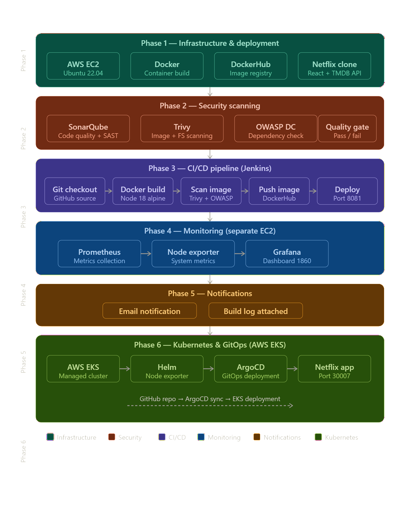

The pipeline is organised into six phases:

| Phase | Focus | Key Tools |
|-------|-------|-----------|
| 1 | Infrastructure & deployment | AWS EC2, Docker, DockerHub |
| 2 | Security scanning | SonarQube, Trivy, OWASP DC |
| 3 | CI/CD pipeline | Jenkins |
| 4 | Monitoring | Prometheus, Grafana |
| 5 | Notifications | Jenkins Email Extension |
| 6 | Kubernetes & GitOps | AWS EKS, Helm, ArgoCD |


## Tools & Technologies

### Infrastructure & Cloud
| Tool | Purpose |
|------|---------|
| AWS EC2 (Ubuntu 22.04) | Application and Jenkins server |
| AWS EC2 (Ubuntu 22.04) | Dedicated monitoring server |
| AWS EKS | Managed Kubernetes cluster |
| Docker | Container build and runtime |
| DockerHub | Container image registry |

### Security
| Tool | Purpose |
|------|---------|
| SonarQube | Static code analysis and quality gate |
| Trivy | Container image and filesystem vulnerability scanning |
| OWASP Dependency Check | Third-party dependency vulnerability scanning |

### CI/CD
| Tool | Purpose |
|------|---------|
| Jenkins | Pipeline automation and orchestration |
| Git / GitHub | Source control and pipeline trigger |

### Monitoring & Observability
| Tool | Purpose |
|------|---------|
| Prometheus | Metrics collection and storage |
| Node Exporter | System-level metrics from EC2 and Kubernetes nodes |
| Grafana | Metrics visualisation and dashboards |

### Kubernetes & GitOps
| Tool | Purpose |
|------|---------|
| AWS EKS | Managed Kubernetes cluster with auto-mode nodes |
| Helm | Kubernetes package management |
| ArgoCD | GitOps continuous deployment |
| kubectl | Kubernetes CLI |

### Scripting & Automation
| Tool | Purpose |
|------|---------|
| Bash | System configuration and automation |
| KQL (via Sentinel) | Query language experience |
| Jenkins pipeline (Groovy) | Pipeline as code |


## Pipeline Phases

### Phase 1 — Infrastructure & Deployment

Provisioned an AWS EC2 instance (Ubuntu 22.04) and installed Docker. 
Built and ran the Netflix clone application as a Docker container, 
passing the TMDB API key as a build argument to enable live movie data.

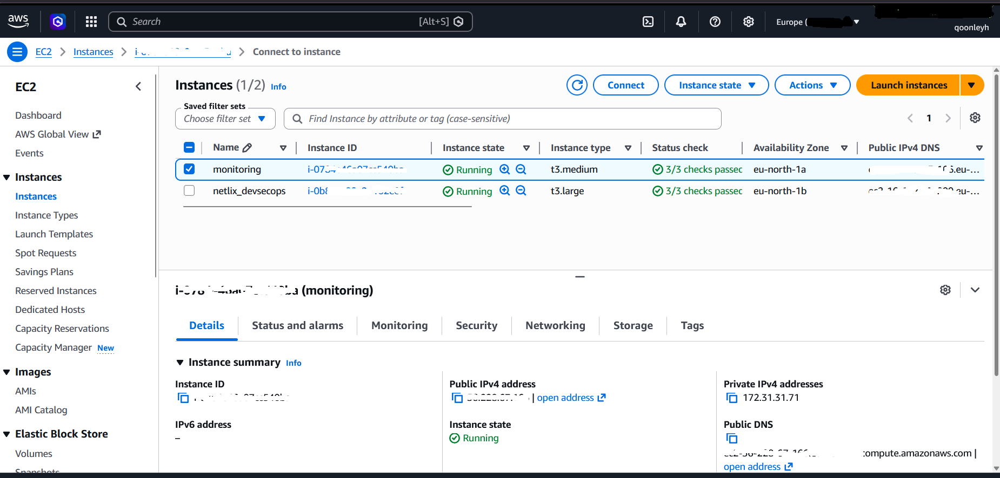
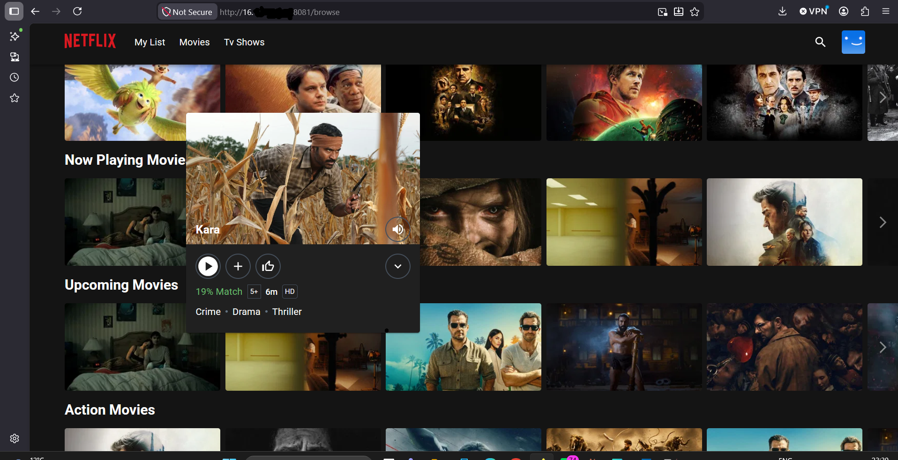

---

### Phase 2 — Security Scanning

Integrated three security tools into the pipeline before any deployment:

- **SonarQube** — deployed as a Docker container, performed static 
  code analysis across 90 source files and enforced a quality gate
- **Trivy** — scanned both the filesystem and the built Docker image 
  for known vulnerabilities, identifying 1 vulnerability in the 
  nginx:stable-alpine base image
- **OWASP Dependency Check** — scanned third-party dependencies 
  for known CVEs

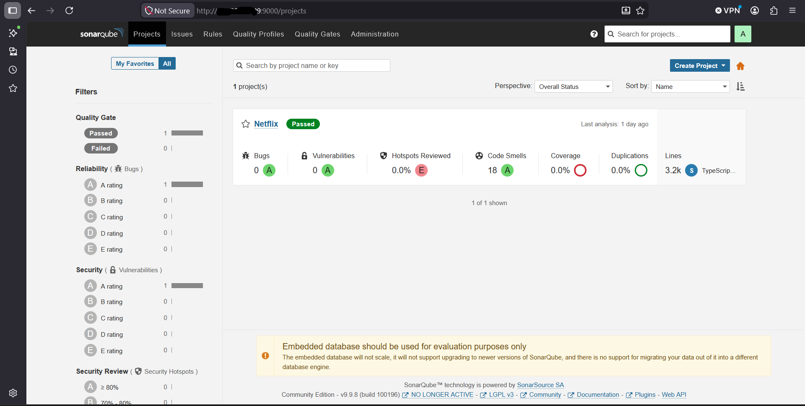
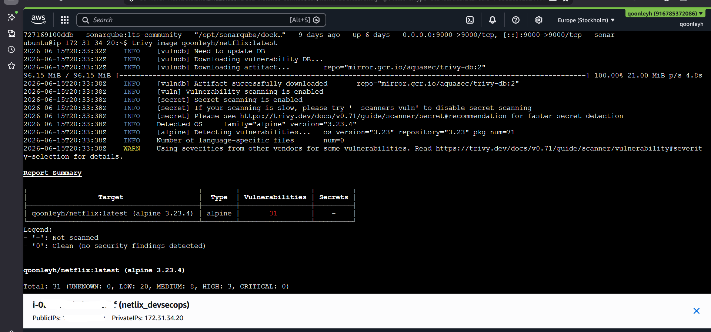

---

### Phase 3 — CI/CD Pipeline (Jenkins)

Built a fully automated Jenkins pipeline with 11 stages running on 
every commit:

1. Clean workspace
2. Checkout from Git
3. SonarQube analysis
4. Quality gate check
5. Fix Dockerfile (Node 18 compatibility patch)
6. Install dependencies
7. OWASP dependency scan
8. Trivy filesystem scan
9. Docker build, tag and push to DockerHub
10. Trivy image scan
11. Deploy to container

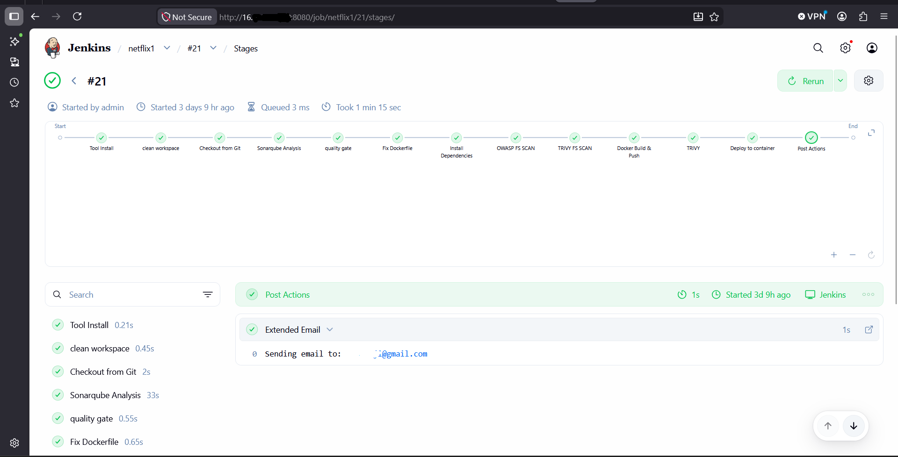
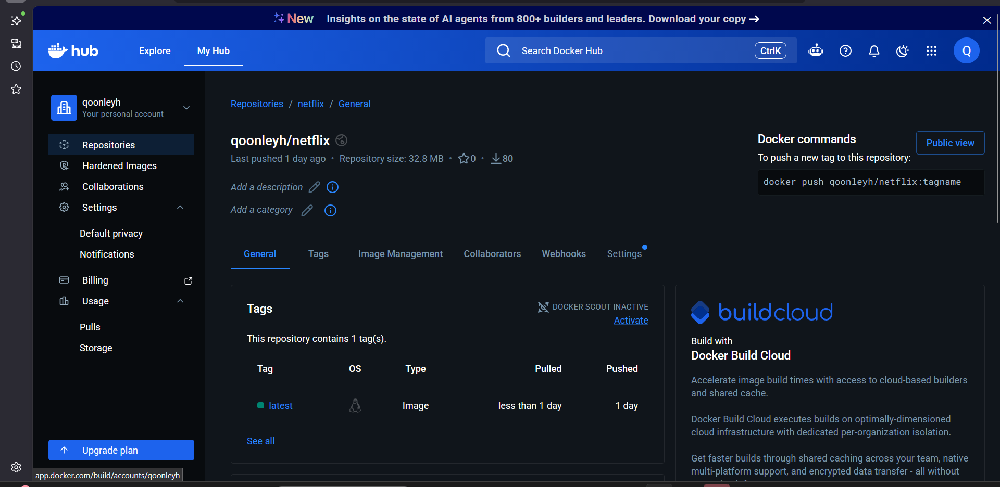

**Key challenge:** The Jenkins Docker plugin bundled an outdated Docker 
client (v1.29) which conflicted with the system Docker daemon 
(v29.5.3). Resolved by removing the plugin tool configuration and 
allowing Jenkins to use the system Docker directly.

---

### Phase 4 — Monitoring

Set up a dedicated monitoring EC2 instance running Prometheus and 
Grafana. Configured scrape targets for:

- Node Exporter on the main EC2 instance
- Jenkins metrics endpoint
- Node Exporter deployed to Kubernetes nodes via Helm

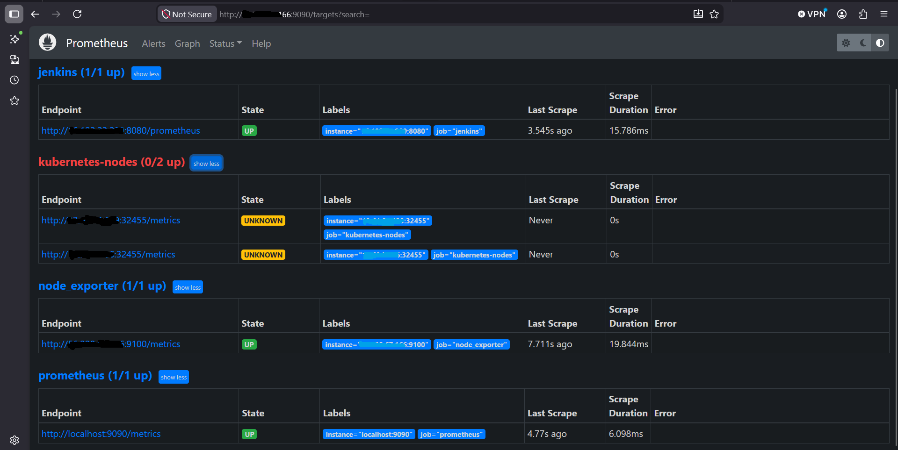
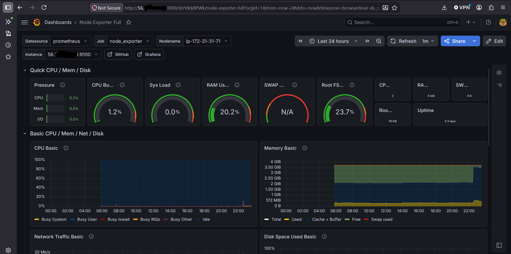
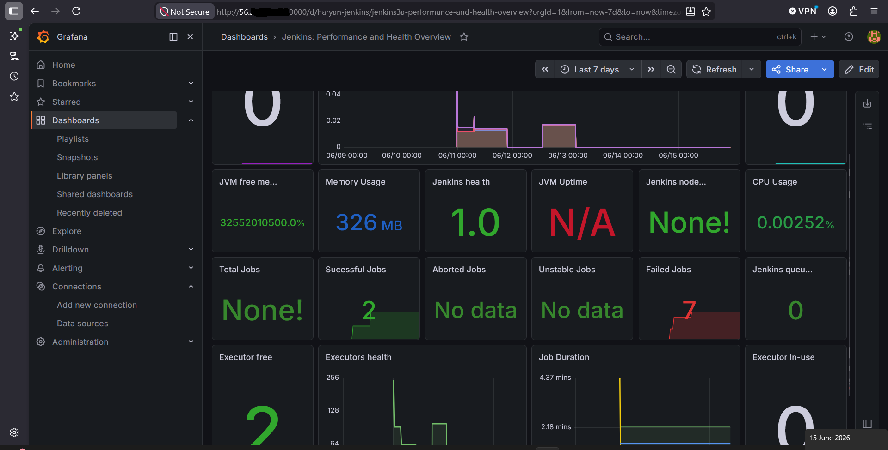

---

### Phase 5 — Notifications

Configured Jenkins Extended Email plugin to send build notifications 
on every pipeline run, attaching the full build log and Trivy scan 
results as evidence of security checks performed.

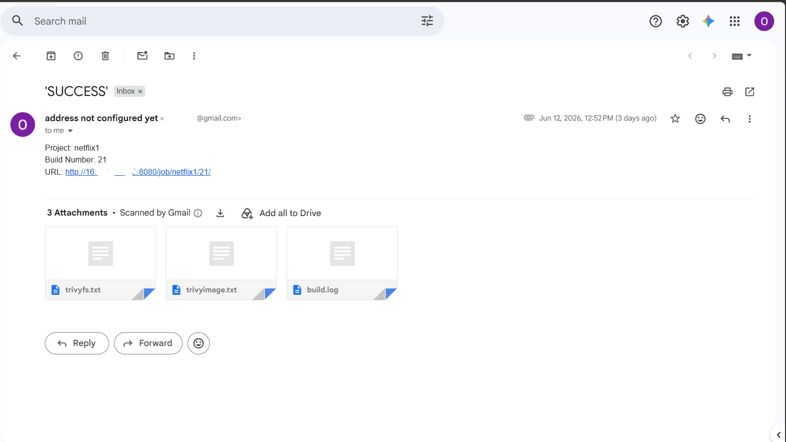

---

### Phase 6 — Kubernetes & GitOps (AWS EKS)

Provisioned an AWS EKS cluster with auto-mode managed nodes and 
deployed the application using GitOps principles:

- **Helm** used to deploy Prometheus Node Exporter to the cluster
- **ArgoCD** installed and configured to watch the GitHub repository
- Application automatically synced from the `Kubernetes/` folder 
  in the repo and deployed to the cluster
- Netflix app accessible at NodePort 30007 on EKS worker nodes

The following terminal outputs confirm all Kubernetes resources 
were running successfully across the cluster:

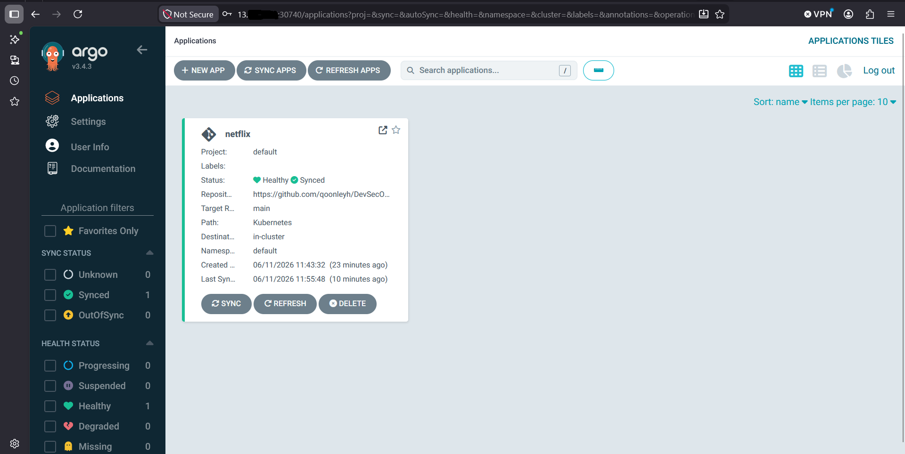
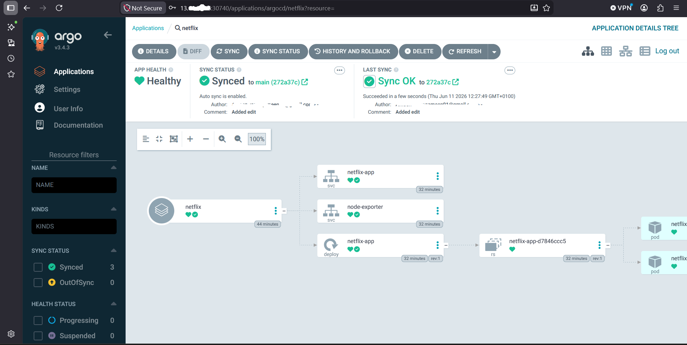
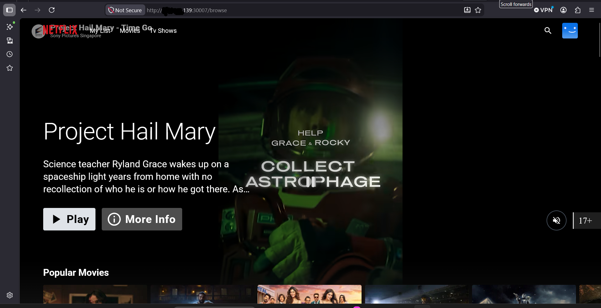
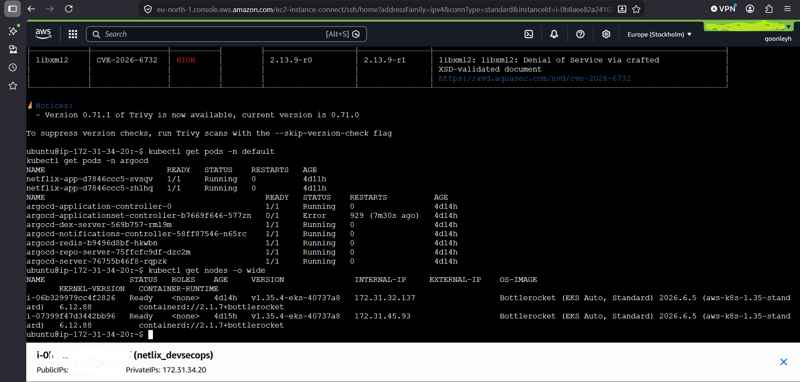
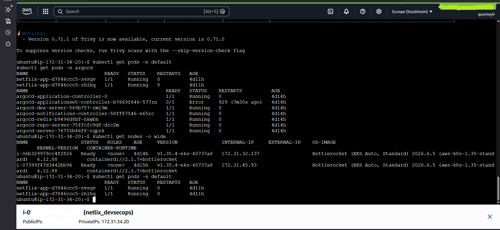
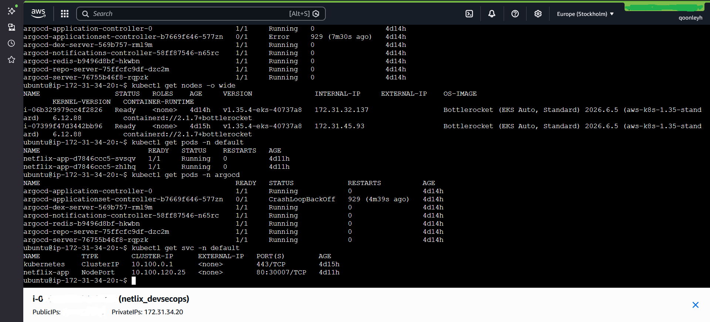


## Key Challenges & Solutions

One of the most valuable aspects of this project was encountering and 
resolving real-world issues that tutorials don't cover. Below are the 
key challenges faced and how each was resolved.

---

### 1. Jenkins Docker plugin version conflict

**Problem:** The Jenkins Docker Commons plugin bundled its own Docker 
client (v1.29) which was far below the minimum API version (1.44) 
required by the Docker daemon installed on the EC2 instance (v29.5.3). 
Every Docker build and push stage failed with:

```
Error response from daemon: client version 1.29 is too old.
Minimum supported API version is 1.44

```
**Cause:** Jenkins was using its own bundled Docker binary from the 
plugin tools configuration rather than the system Docker.

**Solution:** Removed the Docker installation from Jenkins Global Tool 
Configuration entirely, and removed `toolName: 'docker'` from the 
`withDockerRegistry` block in the pipeline script. Jenkins then fell 
back to the system Docker binary (v29.5.3) which worked correctly.

---

### 2. Node.js version incompatibility in Dockerfile

**Problem:** The application required Node 18 or higher but the 
Dockerfile specified `node:16.17.0-alpine`. The Docker build failed 
with:

```
error node-releases@2.0.47: The engine "node" is incompatible.
Expected version ">=18". Got "16.17.0"
```
**Additional complication:** Manually editing the Dockerfile on the 
EC2 instance had no effect because the clean workspace and Git checkout 
stages at the start of every pipeline run pulled a fresh copy of the 
original Dockerfile from GitHub, overwriting the manual fix every time.

**Solution:** Added a dedicated `Fix Dockerfile` stage to the Jenkins 
pipeline that runs after the Git checkout and patches the Dockerfile 
automatically on every build:
```groovy
stage('Fix Dockerfile') {
    steps {
        sh "sed -i 's/node:16.17.0-alpine/node:18-alpine/g' Dockerfile"
    }
}
```

---

### 3. OWASP Dependency Check NVD feed failure

**Problem:** The OWASP Dependency Check stage failed on every build 
with exit code 13:
```
Error retrieving https://nvd.nist.gov/feeds/json/cve/1.1/
nvdcve-1.1-modified.meta; received response code 403 Forbidden
```
**Cause:** The National Vulnerability Database deprecated their legacy 
JSON feed endpoints. The version of the OWASP Dependency Check plugin 
installed was still attempting to use these old URLs which now return 
403 errors.

**Solution:** Wrapped the OWASP stage in a `catchError` block with 
`buildResult: 'SUCCESS'` so the pipeline continues even when the NVD 
feed is unavailable, using whatever cached vulnerability data is 
available locally. This is a known upstream issue with older versions 
of the plugin and not a reflection of the codebase being scanned.

---

### 4. SonarQube quality gate hanging indefinitely

**Problem:** The pipeline would complete the SonarQube analysis 
successfully but then hang at the quality gate stage for hours without 
progressing, eventually requiring manual cancellation.

**Cause:** Jenkins was waiting for a webhook callback from SonarQube 
to confirm the quality gate result. The webhook from SonarQube back to 
Jenkins had not been configured, so Jenkins waited indefinitely.

**Solution:** Two fixes applied together:
- Configured a SonarQube webhook pointing to 
  `http://JENKINS_IP:8080/sonarqube-webhook/`
- Added a `timeout` wrapper to the quality gate stage so the pipeline 
  would not hang if the webhook failed:
```groovy
timeout(time: 2, unit: 'MINUTES') {
    waitForQualityGate abortPipeline: false, credentialsId: 'Sonar-token'
}
```

---

### 5. DockerHub authentication failure

**Problem:** Docker login in the Jenkins pipeline failed with 
authentication errors despite correct credentials being configured.

**Cause:** DockerHub deprecated password-based authentication for 
programmatic access. Standard account passwords no longer work for 
CLI or API authentication.

**Solution:** Generated a DockerHub Access Token via Account Settings 
→ Security → Access Tokens, and replaced the password in the Jenkins 
credential with the token. Authentication succeeded immediately.

---

### 6. EKS Auto Mode nodes not visible in EC2 console

**Problem:** After provisioning the EKS cluster using Auto Mode, the 
worker nodes were not visible as EC2 instances in the AWS console, 
making it impossible to locate and modify their security groups through 
the standard EC2 interface.

**Cause:** EKS Auto Mode manages node lifecycle in AWS-controlled 
infrastructure. The nodes do not appear as customer-owned EC2 instances 
and their security groups cannot be modified directly through the EC2 
console.

**Solution:** Worked within the constraints of Auto Mode by opening 
the full Kubernetes NodePort range (30000-32767) at the cluster 
security group level and accessing services via NodePort rather than 
LoadBalancer. In a production environment this would be addressed by 
using a standard managed node group instead of Auto Mode, or by 
installing the AWS Load Balancer Controller.

---

### 7. ArgoCD InvalidSpecError on first sync

**Problem:** After creating the ArgoCD application, the sync failed 
immediately with:
```
InvalidSpecError: Namespace for netflix-app /v1, Kind=Service is missing
```
**Cause:** The Kubernetes manifests in the repository did not specify 
a namespace, and the ArgoCD application had been created without a 
destination namespace configured.

**Solution:** Edited the ArgoCD application settings to set the 
destination namespace to `default` and enabled the Auto-Create 
Namespace option. The sync completed successfully on the next attempt.

---

### 8. Grafana GPG key installation failure

**Problem:** The standard Grafana installation command failed on the 
monitoring EC2 instance:
```
sudo: 'apt-key': command not found
```
**Cause:** The `apt-key` command has been deprecated and removed in 
newer versions of Ubuntu. The Grafana documentation still referenced 
the legacy installation method.

**Solution:** Used the modern GPG key installation method:
```bash
wget -q -O - https://packages.grafana.com/gpg.key | gpg --dearmor | \
sudo tee /etc/apt/keyrings/grafana.gpg > /dev/null

echo "deb [signed-by=/etc/apt/keyrings/grafana.gpg] \
https://packages.grafana.com/oss/deb stable main" | \
sudo tee /etc/apt/sources.list.d/grafana.list
```

---

### 9. SonarQube container stopping after Docker restart

**Problem:** After restarting the Docker service to pick up group 
membership changes for the Jenkins user, the SonarQube container 
stopped and the pipeline failed with connection refused errors to 
port 9000.

**Cause:** The SonarQube container was not configured to restart 
automatically when Docker restarted.

**Solution:** Updated the container restart policy to ensure automatic 
recovery:
```bash
docker update --restart unless-stopped sonar
```
## How to Run

### Prerequisites

- AWS account with appropriate IAM permissions
- DockerHub account
- GitHub account
- TMDB API key (free at themoviedb.org)
- Gmail account with 2FA enabled (for email notifications)

---

### Phase 1 — Launch EC2 and Install Dependencies

**1. Launch an EC2 instance:**
- AMI: Ubuntu 22.04
- Instance type: t2.large (minimum — Jenkins + SonarQube require 8GB RAM)
- Open inbound ports: 22, 80, 443, 8080, 8081, 9000, 9090, 3000

**2. Install Docker:**
```bash
sudo apt-get update
sudo apt-get install -y ca-certificates curl gnupg
sudo install -m 0755 -d /etc/apt/keyrings
curl -fsSL https://download.docker.com/linux/ubuntu/gpg | \
  sudo gpg --dearmor -o /etc/apt/keyrings/docker.gpg
echo "deb [arch=$(dpkg --print-architecture) \
  signed-by=/etc/apt/keyrings/docker.gpg] \
  https://download.docker.com/linux/ubuntu \
  $(. /etc/os-release && echo "$VERSION_CODENAME") stable" | \
  sudo tee /etc/apt/sources.list.d/docker.list > /dev/null
sudo apt-get update
sudo apt-get install -y docker-ce docker-ce-cli containerd.io
sudo usermod -aG docker $USER
```

**3. Run SonarQube as a Docker container:**
```bash
docker run -d --name sonar -p 9000:9000 \
  --restart unless-stopped sonarqube:lts-community
```

Access SonarQube at `http://YOUR_EC2_IP:9000`
Default credentials: `admin` / `admin`

---

### Phase 2 — Install Jenkins

**1. Install Java and Jenkins:**
```bash
sudo apt update
sudo apt install -y fontconfig openjdk-17-jre
sudo wget -O /usr/share/keyrings/jenkins-keyring.asc \
  https://pkg.jenkins.io/debian-stable/jenkins.io-2023.key
echo "deb [signed-by=/usr/share/keyrings/jenkins-keyring.asc] \
  https://pkg.jenkins.io/debian-stable binary/" | \
  sudo tee /etc/apt/sources.list.d/jenkins.list > /dev/null
sudo apt-get update
sudo apt-get install -y jenkins
sudo systemctl enable jenkins
sudo systemctl start jenkins
```

**2. Add Jenkins to the Docker group:**
```bash
sudo usermod -aG docker jenkins
sudo systemctl restart jenkins
```

**3. Install Jenkins plugins:**
- Eclipse Temurin Installer
- SonarQube Scanner
- NodeJS Plugin
- Email Extension Plugin
- OWASP Dependency Check
- Docker Pipeline
- Prometheus Metrics

**4. Configure Jenkins tools:**
- JDK 17
- NodeJS 16
- SonarQube Scanner

**5. Configure Jenkins credentials:**
- SonarQube token (ID: `Sonar-token`)
- DockerHub access token (ID: `docker`)
- Gmail app password (ID: `gmail`)

**6. Configure SonarQube webhook:**

In SonarQube go to Administration → Configuration → Webhooks:

```
Name: jenkins
URL: http://YOUR_JENKINS_IP:8080/sonarqube-webhook/
```
---

### Phase 3 — Configure the Pipeline

**1. Install Trivy:**
```bash
wget -qO - https://aquasecurity.github.io/trivy-repo/deb/public.key | \
  gpg --dearmor | sudo tee /etc/apt/trusted.gpg.d/trivy.gpg > /dev/null
echo "deb [signed-by=/etc/apt/trusted.gpg.d/trivy.gpg] \
  https://aquasecurity.github.io/trivy-repo/deb generic main" | \
  sudo tee /etc/apt/sources.list.d/trivy.list
sudo apt-get update
sudo apt-get install -y trivy
```

**2. Create a new Jenkins pipeline and paste the pipeline script.**

> Note: Replace `qoonleyh` with your DockerHub username and 
> `your@email.com` with your email address throughout the script.

**3. Get your TMDB API key** from themoviedb.org and add it to the 
pipeline script's Docker build argument.

---

### Phase 4 — Set Up Monitoring

**1. Launch a second EC2 instance** (t2.micro is sufficient).

**2. Install Prometheus:**
```bash
sudo useradd --system --no-create-home --shell /bin/false prometheus
wget https://github.com/prometheus/prometheus/releases/download/v2.47.1/prometheus-2.47.1.linux-amd64.tar.gz
tar -xvf prometheus-2.47.1.linux-amd64.tar.gz
sudo mkdir -p /data /etc/prometheus
sudo mv prometheus-2.47.1.linux-amd64/prometheus \
  prometheus-2.47.1.linux-amd64/promtool /usr/local/bin/
sudo mv prometheus-2.47.1.linux-amd64/prometheus.yml /etc/prometheus/
sudo chown -R prometheus:prometheus /etc/prometheus/ /data/
sudo systemctl enable prometheus
sudo systemctl start prometheus
```

**3. Install Node Exporter on the main EC2 instance:**
```bash
sudo useradd --system --no-create-home --shell /bin/false node_exporter
wget https://github.com/prometheus/node_exporter/releases/download/v1.6.1/node_exporter-1.6.1.linux-amd64.tar.gz
tar -xvf node_exporter-1.6.1.linux-amd64.tar.gz
sudo mv node_exporter-1.6.1.linux-amd64/node_exporter /usr/local/bin/
sudo systemctl enable node_exporter
sudo systemctl start node_exporter
```

**4. Configure Prometheus scrape targets** in 
`/etc/prometheus/prometheus.yml`:
```yaml
scrape_configs:
  - job_name: 'node_exporter'
    static_configs:
      - targets: ['MAIN_EC2_IP:9100']

  - job_name: 'jenkins'
    metrics_path: '/prometheus'
    static_configs:
      - targets: ['MAIN_EC2_IP:8080']
```

**5. Install Grafana:**
```bash
wget -q -O - https://packages.grafana.com/gpg.key | gpg --dearmor | \
  sudo tee /etc/apt/keyrings/grafana.gpg > /dev/null
echo "deb [signed-by=/etc/apt/keyrings/grafana.gpg] \
  https://packages.grafana.com/oss/deb stable main" | \
  sudo tee /etc/apt/sources.list.d/grafana.list
sudo apt-get update
sudo apt-get install -y grafana
sudo systemctl enable grafana-server
sudo systemctl start grafana-server
```

Access Grafana at `http://YOUR_MONITORING_IP:3000`
Default credentials: `admin` / `admin`

Import dashboard ID `1860` for Node Exporter metrics.

---

### Phase 5 — Configure Email Notifications

**1. Generate a Gmail App Password:**
- Enable 2FA on your Google account
- Go to Account Settings → Security → App Passwords
- Generate a password for Jenkins

**2. Configure Extended Email Notification in Jenkins:**
- SMTP Server: `smtp.gmail.com`
- SMTP Port: `465`
- Use SSL: enabled
- Credentials: your Gmail app password

**3. Add the post block to your pipeline script:**
```groovy
post {
    always {
        emailext attachLog: true,
            subject: "'${currentBuild.result}'",
            body: "Project: ${env.JOB_NAME}<br/>" +
                "Build Number: ${env.BUILD_NUMBER}<br/>" +
                "URL: ${env.BUILD_URL}<br/>",
            to: 'your@email.com',
            attachmentsPattern: 'trivyfs.txt,trivyimage.txt'
    }
}
```

---

### Phase 6 — Kubernetes & GitOps

**1. Install kubectl and AWS CLI on your main EC2 instance.**

**2. Create an EKS cluster** via the AWS console:
- Kubernetes version: 1.35
- Node group: at least 2 nodes
- Node type: t3.medium minimum

**3. Connect kubectl to your cluster:**
```bash
aws eks update-kubeconfig --region YOUR_REGION --name YOUR_CLUSTER_NAME
kubectl get nodes
```

**4. Install Helm and deploy Node Exporter:**
```bash
curl https://raw.githubusercontent.com/helm/helm/main/scripts/get-helm-3 | bash
helm repo add prometheus-community \
  https://prometheus-community.github.io/helm-charts
kubectl create namespace prometheus-node-exporter
helm install prometheus-node-exporter \
  prometheus-community/prometheus-node-exporter \
  --namespace prometheus-node-exporter
```

**5. Install ArgoCD:**
```bash
kubectl create namespace argocd
kubectl apply -n argocd -f \
  https://raw.githubusercontent.com/argoproj/argo-cd/stable/manifests/install.yaml
kubectl patch svc argocd-server -n argocd \
  -p '{"spec": {"type": "NodePort"}}'
```

**6. Get ArgoCD admin password:**
```bash
kubectl -n argocd get secret argocd-initial-admin-secret \
  -o jsonpath="{.data.password}" | base64 -d
```

**7. Create ArgoCD application:**
- Repository URL: your GitHub repo
- Path: `Kubernetes`
- Cluster URL: `https://kubernetes.default.svc`
- Namespace: `default`
- Sync policy: Automatic

The Netflix app will be accessible at:
http://NODE_PUBLIC_IP:30007


## Key Learnings

### Technical

**DevSecOps pipeline design:**  
Building a pipeline where security is integrated at every stage rather 
than added on at the end changes how you think about deployment. 
Having SonarQube, Trivy, and OWASP running before any image is pushed 
or deployed means vulnerabilities are caught at the source, not in 
production.

**The gap between tutorials and implementation due to software version update:**  
Every major tool in this project had at least one issue 
that the tutorial did not cover. These issues, including deprecated APIs, version conflicts, 
changed authentication methods, renamed AWS console fields,  arose from the change in software version and integration style. 
Learning to read error messages, search for root causes, and fix problems 
independently was as valuable as the tools themselves.

**Container security is not optional:**  
Trivy identified a vulnerability in the nginx:stable-alpine base image 
on the first scan. In a production context this would require updating 
to a patched image version before deployment. Integrating this check 
into the pipeline means it happens automatically on every build rather 
than being a manual afterthought.

**Kubernetes adds complexity but also capability:**  
Moving from a single Docker container to a Kubernetes deployment via 
ArgoCD introduced significant additional configuration. Configurations such as IAM roles, 
node groups, namespaces, and service types were introduced. The successful configuration resulted in a 
production-grade deployment model with automatic reconciliation, 
rollback capability, and GitOps auditability.

**Monitoring should cover the full stack:**  
Setting up Prometheus and Grafana to cover both the EC2 instance and 
Kubernetes nodes gave a complete picture of resource utilisation across 
the entire infrastructure. Without both layers, issues in either 
environment would be invisible.

**Infrastructure as a security boundary:**  
Security groups, IAM roles, and network configuration are not just 
operational concerns, they directly determine what is and is not 
accessible. EKS Auto Mode in particular surfaced how managed 
infrastructure can abstract away security controls that you would 
normally configure directly.

---

### Process

**Document as you go:**  
Screenshots taken during the build were essential for this README. 
Going back to recreate evidence after the fact is significantly harder 
than capturing it at the time.

**Break problems into layers:**  
When a pipeline stage fails, the error is often in a different layer 
than where it appears. The Docker login failure appeared to be a 
credentials problem but was actually a client version problem. Reading 
the full error message and working backwards to the root cause is a 
more reliable debugging approach than fixing the first thing that 
looks wrong.

**Cost awareness matters in cloud projects:**  
Running Jenkins, SonarQube, Prometheus, Grafana, and an EKS cluster 
simultaneously across multiple EC2 instances accumulates cost quickly. 
Building the habit of tearing down resources after use and using 
billing alerts is an essential part of working with cloud 
infrastructure.

---

## What I Would Do Differently

- Use a standard EKS managed node group instead of Auto Mode to 
  retain direct access to node security groups
- Pin the OWASP Dependency Check plugin to a version that supports 
  the current NVD API
- Add a stage to automatically update the base image in the Dockerfile 
  to the latest patched version rather than fixing the Node version 
  manually
- Implement Terraform for infrastructure provisioning to make the 
  entire setup reproducible as code
- Add a rollback stage to the Jenkins pipeline that triggers 
  automatically if the deployed container fails a health check

---

## Acknowledgements

This project was introduced to me by Topteam Ltd led by [aloffawy](https://github.com/aloffawy). Based on the DevSecOps Netflix Clone project by 
[N4si](https://github.com/N4si/DevSecOps-Project), extended with 
additional phases, real-world debugging, and a dedicated monitoring 
infrastructure.
